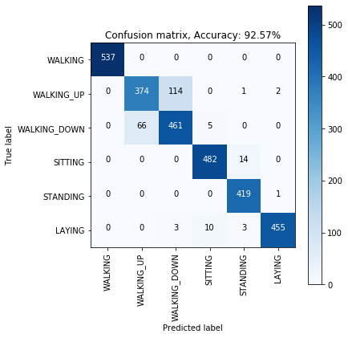

# LSTM-tf-2.x-for-HAR-with-Accelerometer
This is probably the 1st (available on GitHub) 'tf2.x-version' LSTM implemented for Accelerometer data.

This project needs two-step procedures:

(step 1) to train a 'best-trained-model' for transfer learning on a target dataset (with labeling). 

(step 2) to use the saved 'best-trained-model' to test a target dataset (without labeling).

This notebook 'LSTM_UCI2012Acc_TransferLearning.ipynb' covers the step 1.

This notebook 'imec_Acc_case_application.ipynb' covers the step 2.

Before you run the notebook files, Notice:

(1) the 16 excel files (for target dataset) should be put under the folder 'files', they are too large to send by email.
(2) the UCI dataset (source dataset) will be send by using 'Wetransfer' through another email. After download it, put it under the project folder 'imec_case_Acc_LSTM_demo'.

One Result on a open dataset (UCI2012Acc):

    </a>

